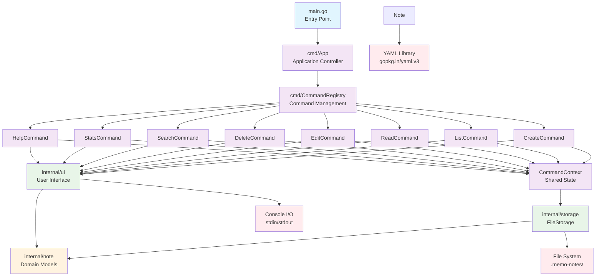
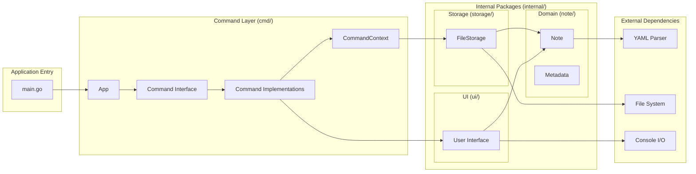
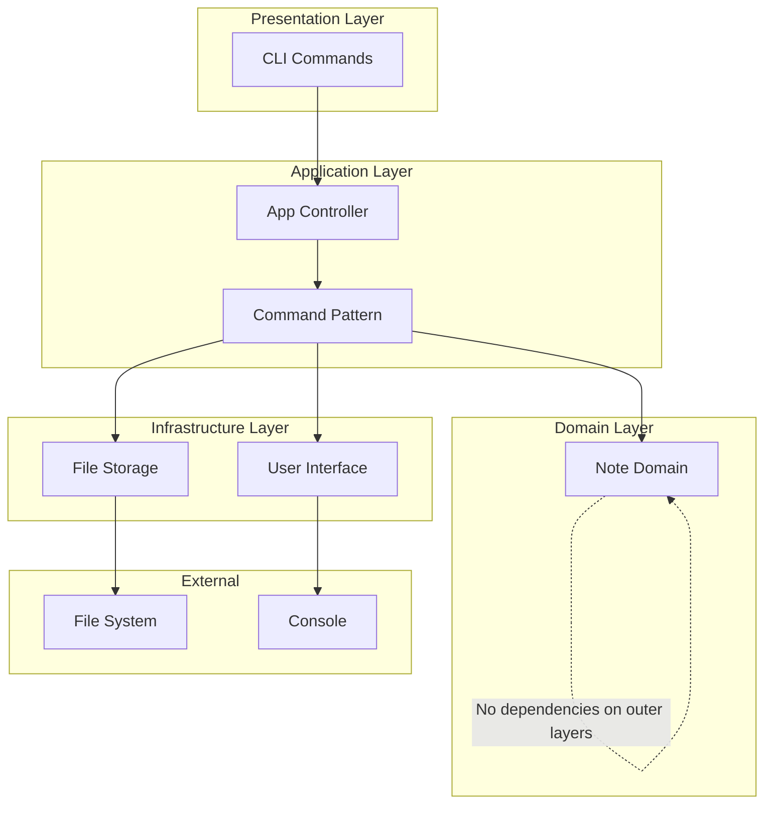
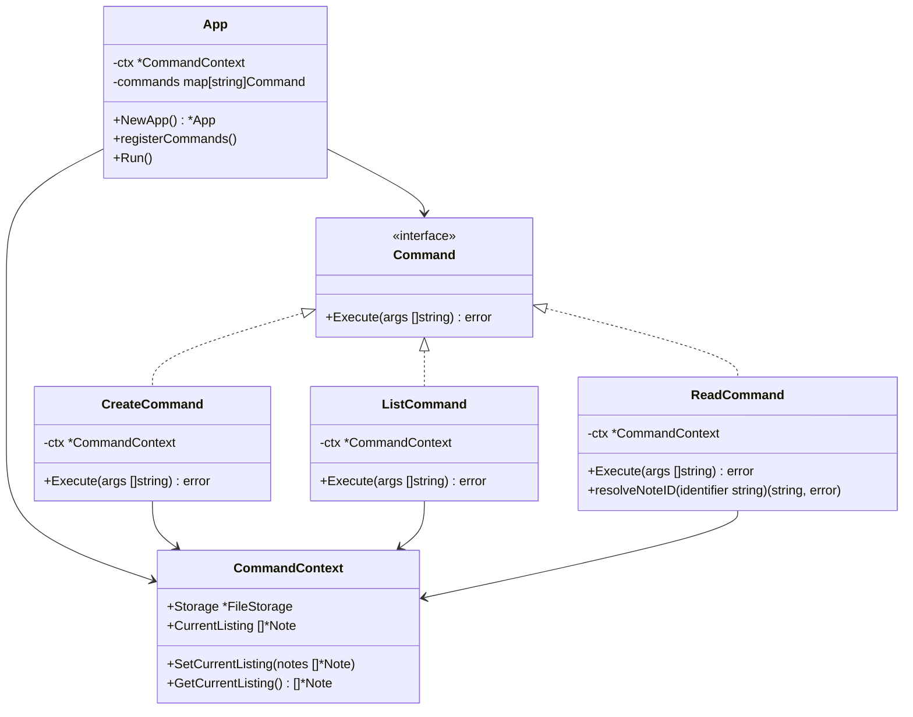
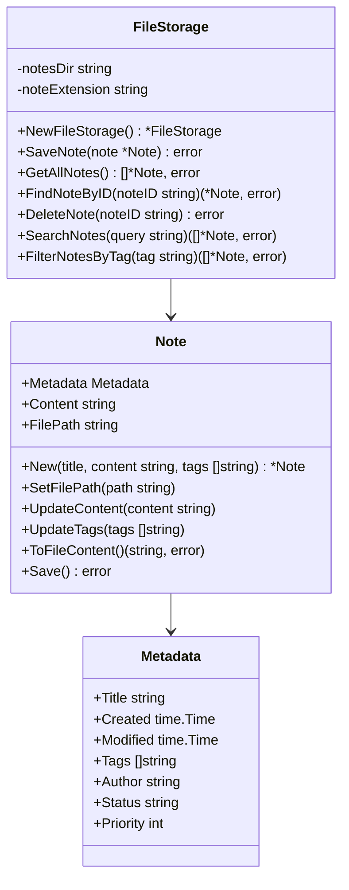
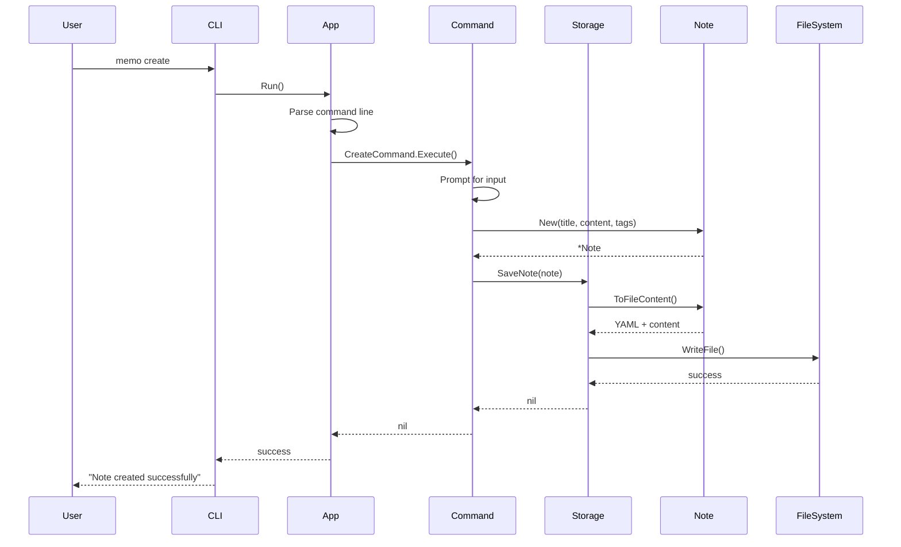

# Memo Application Architecture

This document outlines the architectural structure of the Memo CLI application (a version of Future-Proof-Notes) after refactoring to implement clean separation of concerns and the Command Pattern.

## Overall Architecture

## Package Structure

## Dependency Flow

## Command Pattern Implementation

## Domain Model

## Data Flow

## Key Architectural Benefits

### 1. **Separation of Concerns**
- **Domain Logic**: Pure business rules in `internal/note`
- **Storage Logic**: File operations in `internal/storage`  
- **UI Logic**: User interaction in `internal/ui`
- **Command Logic**: CLI handling in `cmd`

### 2. **Command Pattern Benefits**
- **Extensibility**: Easy to add new commands
- **Testability**: Each command can be unit tested
- **Maintainability**: Single responsibility per command
- **Consistency**: All commands follow same interface

### 3. **Clean Architecture Principles**
- **Dependency Inversion**: Outer layers depend on inner layers
- **Interface Segregation**: Small, focused interfaces
- **Single Responsibility**: Each package has one reason to change
- **Open/Closed**: Open for extension, closed for modification

### 4. **Future-Proofing**
- **Plugin Architecture**: Commands can be dynamically registered
- **Storage Abstraction**: Easy to swap file storage for database
- **UI Abstraction**: Can support web UI or GUI in future
- **Domain Purity**: Business logic independent of infrastructure

## Package Responsibilities

| Package | Responsibility | Dependencies |
|---------|---------------|--------------|
| `main` | Application entry point | `cmd` |
| `cmd` | CLI command handling & routing | `internal/*` |
| `internal/note` | Domain models & business logic | Standard library, YAML |
| `internal/storage` | Data persistence operations | `internal/note` |
| `internal/ui` | User interface & interaction | `internal/note` |

This architecture makes the codebase beginner-friendly while maintaining professional standards for scalability and maintainability.